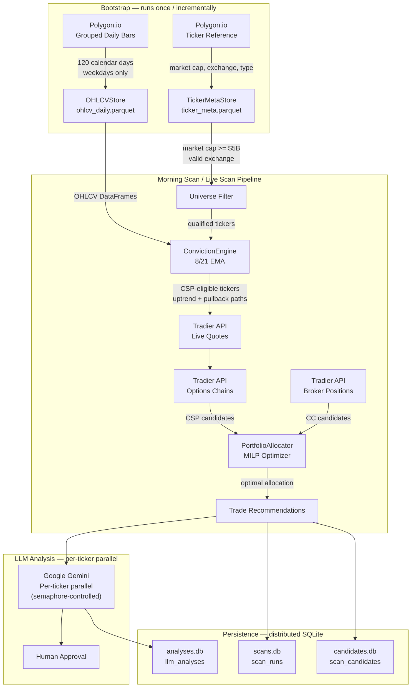

# Tyche Options — Architecture

**Status:** Living document (reflects the implemented system as of March 2026)

## Overview

Tyche Options is a laptop-based options trading copilot that combines deterministic screening rules with LLM-assisted analysis to identify Cash-Secured Put (CSP) and Covered Call (CC) opportunities using the Wheel Strategy. The system is built on a conviction-first architecture: stocks must pass through a multi-stage filter pipeline grounded in 8/21 EMA trend analysis before any options scanning occurs.

## Technology Stack

| Layer | Technology |
|---|---|
| API | FastAPI, Pydantic, uvicorn |
| Broker (real-time) | Tradier API — quotes, options chains, account ops, order execution |
| Market data (historical) | Polygon.io — grouped daily OHLCV bars, ticker reference metadata |
| Data stores | Apache Parquet via PyArrow (OHLCVStore, TickerMetaStore) |
| Conviction engine | pandas, numpy — 8/21 EMA trend classification |
| Portfolio optimization | scipy.optimize.milp (HiGHS MILP solver) |
| LLM analysis | Google Gemini (gemini-3-flash-preview / gemini-3.1-pro-preview) via google-genai |
| Database (operational) | Distributed SQLite (per-domain files) + SQLAlchemy 2.0 async + Alembic |
| Scheduling | APScheduler |
| Logging | structlog (JSON structured logging) |
| Language | Python 3.12+ |

## Data Flow



## Component Map

```
backend/
├── scripts/
│   ├── backtest_ema.py          # Backtest: uptrend CSP sim + capital-aware portfolio sim
│   ├── backtest_pullback_csp.py # Backtest: pullback CSP sim (strike offsets × DTE × market cap)
│   ├── backfill_market_caps.py  # Backfill market cap data from Polygon detail API
│   └── live_scan.py             # Standalone live scanner (CLI, uses Tradier + conviction)
├── src/tyche/
│   ├── app.py                   # FastAPI application factory + lifespan
│   ├── config.py                # TycheSettings (all TYCHE_* env vars via pydantic-settings)
│   ├── exceptions.py            # Custom exception hierarchy
│   ├── logging.py               # structlog configuration
│   │
│   ├── api/
│   │   ├── deps.py              # Dependency injection — singleton providers for all services
│   │   └── routes/
│   │       ├── account.py       # GET /account/balances, /account/positions
│   │       ├── conviction.py    # GET /conviction/signals, POST /conviction/bootstrap
│   │       ├── events.py        # SSE endpoint for real-time events
│   │       ├── intents.py       # POST /intents/generate (order intent generation)
│   │       ├── monitor.py       # GET /monitor/status (active position monitor)
│   │       ├── orders.py        # POST /orders/preview, /orders/place
│   │       ├── scanner.py       # POST /scanner/scan, /scanner/explore, GET /latest, /history
│   │       ├── system.py        # GET /health, /system/status
│   │       └── watchlist.py     # GET/PUT /watchlist
│   │
│   ├── analysis/
│   │   ├── agent.py             # AnalysisAgent — orchestrates LLM calls for CSP analysis
│   │   ├── client.py            # GeminiClient — google-genai wrapper
│   │   ├── grounding.py         # Grounding rules injected into LLM prompts
│   │   └── prompts.py           # Prompt templates for CSP/CC analysis
│   │
│   ├── broker/
│   │   ├── base.py              # BrokerClient ABC + data models (Quote, Position, etc.)
│   │   ├── mock.py              # MockBroker for dev/testing
│   │   ├── polygon_adapter.py   # Polygon-to-BrokerClient adapter (unused in prod)
│   │   └── tradier/
│   │       ├── client.py        # TradierClient — full Tradier API implementation
│   │       └── symbols.py       # OCC symbol parsing utilities
│   │
│   ├── conviction/
│   │   └── engine.py            # ConvictionEngine — 8/21 EMA trend + conviction scoring
│   │
│   ├── market_data/
│   │   ├── data_store.py        # OHLCVStore + TickerMetaStore (Parquet) + bootstrap_ohlcv()
│   │   ├── earnings.py          # EarningsCalendarClient (Alpha Vantage)
│   │   ├── institutional.py     # Institutional ownership filter
│   │   ├── polygon.py           # PolygonClient — grouped daily, ticker reference, market caps
│   │   └── universe.py          # UniverseBuilder — watchlist screening
│   │
│   ├── models/
│   │   ├── order_intent.py      # OrderIntent ORM model (intents for human approval)
│   │   ├── scan.py              # ScanRun, ScanCandidate, LLMAnalysisRecord ORM models
│   │   ├── conviction.py        # ConvictionSnapshot, ConvictionTransition
│   │   ├── backtest.py          # PullbackEvent, TickerPullbackProfile, StockPosition, ExitSignal
│   │   └── ...                  # Account, candidate, journal, etc.
│   │
│   ├── persistence/
│   │   ├── database.py          # Multi-engine registry (named engines per SQLite file)
│   │   ├── scan_repository.py   # Save/load/cleanup scan results across distributed DBs
│   │   ├── conviction_repository.py  # Conviction snapshot/transition CRUD
│   │   ├── backtest_repository.py    # Pullback event/profile queries
│   │   └── position_repository.py    # Stock position CRUD + backtest profile lookup on create
│   │
│   ├── schemas/                 # Pydantic request/response schemas
│   │
│   ├── risk/
│   │   ├── engine.py            # RiskEngine — evaluates candidates against rule chain
│   │   ├── kill_switch.py       # Emergency kill switch
│   │   └── rules.py             # Individual risk rules (cash collateral, max positions, etc.)
│   │
│   ├── strategy/
│   │   ├── allocator.py         # PortfolioAllocator — MILP optimizer (scipy)
│   │   ├── engine.py            # StrategyEngine — orchestrates CSP/CC scanning
│   │   └── strategies/
│   │       ├── base.py          # ScoredCandidate dataclass + strategy ABC
│   │       ├── cash_secured_put.py  # CSP strategy implementation
│   │       └── covered_call.py      # CC strategy implementation
│   │
│   └── workflow/
│       ├── active_monitor.py    # Real-time position/order monitoring
│       ├── conviction_batch.py  # Batch conviction engine run across all tickers
│       ├── eod_journal.py       # End-of-day journaling
│       ├── exit_monitor.py      # Stock position exit signal checker (profit target + stop loss)
│       ├── expiry_tracker.py    # CSP expiry tracking for fallback alerts
│       ├── intent_builder.py    # Order intent generation from recommendations
│       ├── morning_scan.py      # Full morning scan pipeline orchestration
│       ├── order_monitor.py     # Open order tracking
│       ├── scheduler.py         # APScheduler-based workflow scheduling
│       ├── stock_recommender.py # Stock buy recommendations from pullback alerts
│       └── wheel_tracker.py     # Wheel strategy lifecycle tracking
│
├── tests/unit/                  # pytest unit tests for all major components
├── data/                        # Raw market data (Parquet files, gitignored)
│   ├── ohlcv_daily/             # Per-ticker daily OHLCV bars
│   ├── intraday_5min/           # Per-ticker 5-minute intraday bars
│   └── ticker_meta.parquet      # Ticker reference metadata
├── db/                          # SQLite databases (gitignored)
│   ├── tyche.db                 # Default — order_intents table
│   ├── scans.db                 # Scan runs + pipeline stages + allocation
│   ├── candidates.db            # Scored option candidates per scan
│   └── analyses.db              # LLM analysis records per ticker per scan
└── pyproject.toml               # Dependencies and project metadata
```

## Distributed SQLite Persistence

Tyche uses **separate SQLite files per domain** rather than one monolithic database. This reduces blast radius and maps cleanly to PostgreSQL schemas on migration.

| Database | Tables | Domain |
|---|---|---|
| `db/tyche.db` | `order_intents` | Trade intents awaiting human approval |
| `db/scans.db` | `scan_runs` | Scan metadata, pipeline stages, allocation summary |
| `db/candidates.db` | `scan_candidates` | One row per scored option contract per scan |
| `db/analyses.db` | `llm_analyses` | One row per ticker per scan (LLM reasoning + status) |
| `db/conviction.db` | `conviction_snapshots`, `conviction_transitions` | Daily conviction state per ticker |
| `db/backtest.db` | `pullback_events`, `ticker_pullback_profiles`, `stock_positions`, `exit_signals` | Historical backtest data + stock position tracking |

The multi-engine registry in `persistence/database.py` manages named engines:

```python
register_engine("scans", "sqlite+aiosqlite:///db/scans.db")
async with get_session("scans") as session:
    ...
```

**Scan retention:** The last N scans are kept (default 5, configurable via `scan_retention_count`). After each new scan, older scans are cleaned up across all three scanner DBs.

**PostgreSQL migration path:** Replace `init_scanner_dbs()` with a single `init_db(postgres_url)`. All `get_session("scans")` calls become `get_session()` pointing at the single PG connection pool. Table schemas are PostgreSQL-compatible.

## Key Architectural Patterns

### Dependency Injection

All service instances are created as singletons in `api/deps.py` and injected via FastAPI's `Depends()`. This includes broker clients, conviction engine, data stores, risk engine, portfolio allocator, and the LLM analysis agent. A `reset_all()` function clears all singletons for testing.

### Hybrid Market Data

Two separate APIs serve different purposes:
- **Polygon.io** provides historical daily OHLCV bars (grouped daily endpoint) and ticker reference metadata (market cap, exchange, type). This data is cached locally in Parquet files and used by the conviction engine and backtest.
- **Tradier** provides real-time quotes, options chains, account balances, positions, and order execution. It is the broker of record.

### Conviction-First Filtering

The conviction engine acts as the primary gate. No stock reaches options scanning without first passing through:
1. Universe filters (market cap, exchange, price, volume)
2. EMA trend classification
3. CSP eligibility check via one of two paths:
   - **Uptrend path (A):** trend state + extension cap ≤3% + 5-10 day streak above both EMAs. Strikes: 15% below price → 8-EMA ceiling.
   - **Pullback path (B):** pullback to EMA support + prior streak ≥5 days + rising 21-EMA slope. Strikes: 5% below → 1% below support EMA.

The pullback path was added based on backtest validation (76.8% win rate on $5B+ stocks). After collecting candidates from both paths, the engine filters to only the **earliest expiration date** across all tickers (configurable via `TYCHE_EARLIEST_EXPIRATION_ONLY`), maximizing capital recycling speed.

This reduces API calls to Tradier and ensures only high-conviction candidates are evaluated.

### Parquet-First Data Layer

Historical data is stored in local Parquet files rather than a database. This enables:
- Fast columnar reads for EMA computation across thousands of tickers
- Easy backtest integration (same data, same filters)
- No database migration needed for schema changes to analytical data
- Incremental bootstrap (only fetch missing dates)

## Scanner vs Conviction Engine

These are two distinct scans that serve different purposes in the pipeline:

### Conviction Engine Scan (`GET /conviction/scan`)

**Purpose:** EMA-based trend analysis only — no broker calls, no options chains, no LLM.

- Reads from local OHLCV Parquet data (no network calls)
- Computes 8/21 EMAs and classifies trend states
- Returns CSP-eligible tickers with conviction levels
- Fast (sub-second for full universe of 13K+ tickers)
- Input: watchlist symbols, or blank for full universe screen
- Output: trend state, conviction level, EMA values, eligibility flag

**When to use:** To check which stocks currently have strong technicals before deciding what to scan with the full Scanner.

### Scanner (`POST /scanner/scan`)

**Purpose:** Full end-to-end scan pipeline — broker calls, options chains, LLM analysis, intent creation.

- Calls Tradier API for live quotes and options chains (network-dependent)
- Runs the conviction engine internally as a filter
- Fetches real option contracts with bid/ask/greeks
- Filters option strikes to within `strike_range_pct` (default 15%) below the 8-EMA
- Limits to `max_expiration_dates` (default 2) nearest valid expirations
- Sends candidates to LLM (Gemini) for thesis/risk analysis — **per-ticker parallel** with configurable concurrency
- Runs the intent risk pipeline (deterministic risk gate)
- Creates OrderIntent records in the database
- **Persists all results** to distributed SQLite (scan runs, candidates, analyses) — survives restarts
- Slow (30s–2min depending on universe size and API latency)
- Input: watchlist symbols, or blank for dynamic universe discovery
- Output: scored candidates, LLM analyses, created intents, scan history

**When to use:** To generate actionable trade recommendations with real pricing that you can approve/reject on the Intents page.

### Options Explorer (`POST /scanner/explore`)

**Purpose:** Lightweight options explorer — bypasses the full Scanner pipeline. Useful for quickly checking available put contracts on conviction-eligible tickers without running the full pipeline.

- Accepts comma-separated tickers and optional capital override
- Fetches live quotes + nearest expiration via Tradier (uses broker TTL cache)
- Applies minimal filters: OTM puts, bid > 0, OI >= 1
- Returns scored candidates sorted by annualized return
- No conviction filtering, no LLM, no allocator — raw options data
- Fast (sub-second with broker cache)
- Frontend: dedicated Explore page at `/options/explore`

### Pipeline Relationship

```
Conviction Scan ──► trend signals (informational)

Explorer ──► broker quotes ──► options chains ──► scored candidates (exploratory)

Scanner ──► conviction filter ──► broker quotes ──► options chains
        ──► earliest-expiration filter ──► MILP allocator
        ──► LLM analysis ──► risk gate ──► OrderIntents (actionable)
```

The Scanner calls the Conviction Engine internally — you don't need to run conviction first. The Explorer is independent of both and useful for ad-hoc exploration.

## Related Documentation

- [Conviction Engine Rules](conviction-engine.md)
- [Intent Risk Pipeline](intent-risk-pipeline.md)
- [Portfolio Allocator](portfolio-allocator.md)
- [Data Pipeline](data-pipeline.md)
- [Live Scan Workflow](live-scan.md)
- [Backtest Methodology](backtest.md)
- [Configuration Reference](configuration.md)
