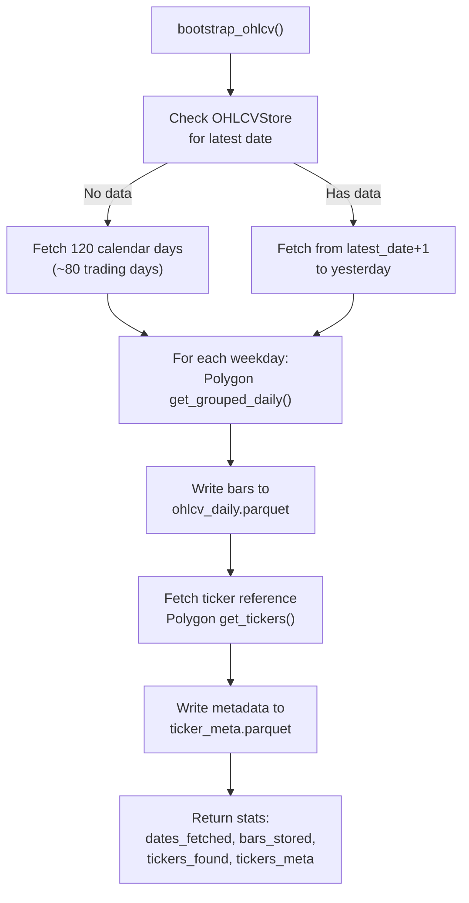

# Data Pipeline

**Sources:**
- `backend/src/tyche/market_data/data_store.py`
- `backend/src/tyche/market_data/polygon.py`

## Overview

Tyche uses a Parquet-first local data layer for all historical market data. Two stores serve different purposes:

- **OHLCVStore** — Daily OHLCV bars for all US equities (used by conviction engine and backtest)
- **TickerMetaStore** — Per-ticker metadata: market cap, exchange, type (used for universe filtering)

Both are populated from Polygon.io during bootstrap and updated incrementally.

## OHLCVStore

**File:** `data/ohlcv_daily.parquet`

### Schema

| Column | Type | Description |
|---|---|---|
| ticker | string | Stock symbol (e.g., "AAPL") |
| date | date32 | Trading day |
| open | float64 | Opening price |
| high | float64 | Day high |
| low | float64 | Day low |
| close | float64 | Closing price |
| volume | int64 | Share volume |
| vwap | float64 | Volume-weighted average price |

### Deduplication

On every write, rows are deduplicated on `(ticker, date)` keeping the last occurrence. This makes incremental updates safe — re-fetching a date simply overwrites stale data.

### Key Operations

- `write_bars(bars)` — Append daily bars, dedup, sort by (ticker, date), write Parquet with Snappy compression
- `read_ticker(ticker, start_date, end_date)` — Single-ticker DataFrame, sorted by date ascending
- `read_tickers(tickers, start_date, end_date)` — Multi-ticker read, returns `dict[str, DataFrame]`
- `get_all_tickers()` — List all unique tickers in the store
- `screen_universe(min_avg_volume, min_price, min_dollar_volume)` — Local screening using stored data (20-day averages)

## TickerMetaStore

**File:** `data/ticker_meta.parquet`

### Schema

| Column | Type | Description |
|---|---|---|
| ticker | string | Stock symbol |
| name | string | Company name |
| market_cap | float64 | Market capitalization in dollars |
| exchange | string | Primary exchange MIC code (XNYS, XNAS, etc.) |
| type | string | Security type (CS = common stock) |
| last_updated | date32 | Date metadata was last refreshed |

### Key Operations

- `write_meta(tickers)` — Upsert ticker metadata, dedup on ticker symbol
- `get_market_caps(tickers?)` — Return `dict[str, float]` mapping ticker to market cap
- `get_exchanges(tickers?)` — Return `dict[str, str]` mapping ticker to exchange
- `update_market_caps(caps)` — Bulk-update market caps for existing tickers

### Why Persist Market Cap?

Market cap is critical for filtering "good companies" suitable for the Wheel Strategy. Polygon's bulk ticker endpoint (`/v3/reference/tickers`) does not return market cap on Starter plans, so individual `get_ticker_details` calls are used during bootstrap. Persisting the results avoids repeated API calls and enables backtesting with realistic filters.

## Polygon.io Integration

**Source:** `backend/src/tyche/market_data/polygon.py`

### API Endpoints Used

| Method | Endpoint | Purpose |
|---|---|---|
| `get_grouped_daily(date)` | `/v2/aggs/grouped/locale/us/market/stocks/{date}` | All US equity daily bars for one date |
| `get_tickers(market, active, type)` | `/v3/reference/tickers` | Paginated ticker reference (name, exchange, type) |
| `get_ticker_details(ticker)` | `/v3/reference/tickers/{ticker}` | Single ticker details (includes market cap) |
| `get_batch_market_caps(tickers)` | Individual `get_ticker_details` calls | Batch market cap fetch with rate limiting |

### Rate Limiting

The Polygon client respects `TYCHE_POLYGON_RATE_LIMIT_RPM` (default 100 RPM). The `get_batch_market_caps` method includes 0.7s sleep between calls to stay within limits on Starter plans.

### Pagination

The `get_tickers` method handles cursor-based pagination via `next_url`. The API key is appended to the `next_url` for authentication.

## Bootstrap Flow

The `bootstrap_ohlcv()` function in `data_store.py` orchestrates the full data population:



### Triggering Bootstrap

Via API:
```bash
curl -X POST http://localhost:8000/conviction/bootstrap
```

Via Python:
```python
from tyche.market_data.data_store import bootstrap_ohlcv, OHLCVStore, TickerMetaStore
from tyche.market_data.polygon import PolygonClient

polygon = PolygonClient(api_key="...")
store = OHLCVStore(data_dir="data")
meta = TickerMetaStore(data_dir="data")
result = await bootstrap_ohlcv(polygon, store, days=120, meta_store=meta)
```

### Incremental Updates

If the store already contains data, bootstrap only fetches dates after the latest stored date. This makes it safe to run repeatedly — it will only fetch missing days.

## Data Directory

All Parquet files live under `backend/data/` (configurable via `TYCHE_DATA_DIR`). This directory is gitignored to avoid committing large binary files.

```
backend/data/
├── ohlcv_daily.parquet      # ~50-100MB depending on date range
└── ticker_meta.parquet      # ~1MB (ticker reference metadata)
```
