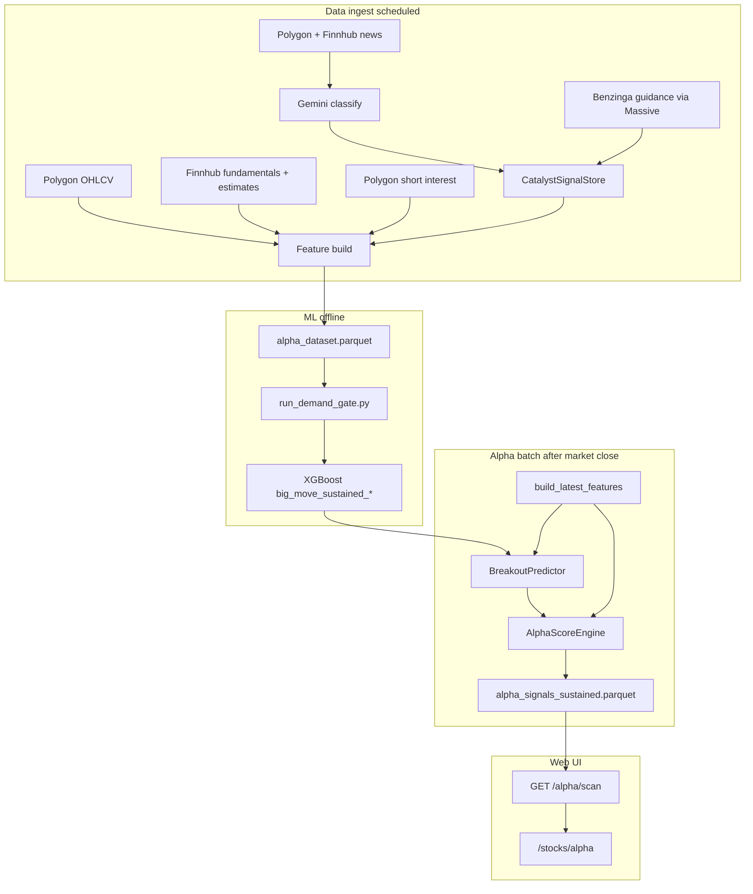
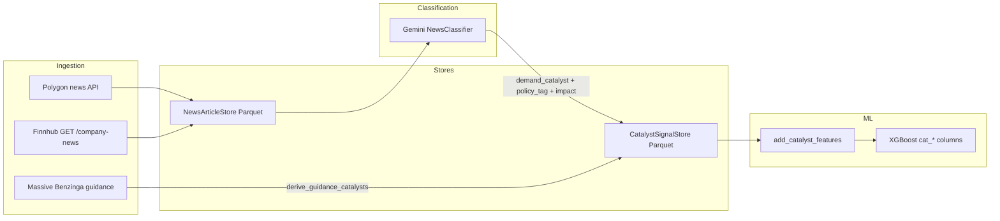

# Directional Alpha Engine (Demand Conviction v2)

**Standalone doc.** This file is meant to explain the full alpha system without reading the
rest of the repo. Diagrams: **§0.2** (end-to-end), **§3.3** (news → ML). If Mermaid does not
render in your viewer, use the ASCII equivalents in those sections.

---

## 0. Context for new readers

### 0.1 What this is

**Tyche Options** is an options/stocks copilot. Its main workflow sells **cash-secured puts**
and **covered calls** near EMA support (income). **Directional Alpha** is a separate product
surface: a ranked list of **stocks to buy for large upside** over roughly 40–120 trading days,
shown at **`/stocks/alpha`** in the web app.

You get a **0–100 Alpha score**, a **buy/watch/avoid** signal, a **horizon** (Swing / Trend /
Thematic), and a breakdown of **six demand dimensions** (fundamentals, estimates, catalysts,
policy, supply chain, squeeze). ML estimates **P(big move)**; rules fuse ML + demand + anti-chase.

### 0.2 End-to-end flow (nightly + page)



ASCII equivalent:

```
  [Polygon OHLCV] [Finnhub fund/est] [short interest] ──► feature rows per ticker/date
  [Polygon+Finnhub news] ──► Gemini ──► CatalystStore ◄── [Benzinga guidance]
                                    │
  offline: features + labels ──► run_demand_gate ──► XGBoost sustained models
  nightly: latest features + models ──► AlphaScoreEngine ──► Parquet snapshot
  UI: GET /alpha/scan ◄── snapshot ──► /stocks/alpha
```

### 0.3 Glossary

| Term | Meaning |
|---|---|
| **Peak model** | Predicts P(price **touches** +25/40/60% at any point in the window). Biased toward flash spikes. |
| **Sustained model** | Predicts P(price is **still up** by that % at the **end** of the window). Default on the page. |
| **Demand gate** | Walk-forward test: do 97 demand features beat ~62 momentum-only features on sustained labels? |
| **D-FUND … D-TECH** | Six demand dimensions scored in the UI and used in the live demand multiplier. |
| **CSP / CC** | Cash-secured put / covered call — the income engine (different goal, different page). |

### 0.4 Document map

| Section | Contents |
|---|---|
| §1 | Why demand-led scoring (thesis) |
| §2 | Parquet stores + ingestion scripts |
| §3 | ML features; **§3.3** news/Finnhub + catalyst diagram |
| §4 | Peak vs sustained **labels** |
| §5 | **Training**, demand gate, inference |
| §6 | How AlphaScore (0–100) is computed |
| §7–8 | Snapshots, API, scheduling |
| §9 | Frontend page behavior |
| §10 | vs income engine |

---

## Introduction

A second signal engine focused on **large upside moves** ("10X" / big-move buys) — the
complement to the CSP / Covered Call income engine. Where the income engine harvests
premium near support, the alpha engine looks for quality names positioned to run hard to
the upside (the kind of move AMD, Micron, and several space names made in 2025–2026).

It does **not** replace any existing page or pipeline — it is purely additive.

> **v1 → v2.** The original engine ranked on price **momentum + ML breakout probability**.
> That structurally favored names that had *already run* (momentum is, by definition, a
> backward read). v2 keeps momentum as a **timing** input but leads with **demand evidence** —
> fundamentals, analyst estimates, corporate guidance vs. consensus, policy tailwinds, and
> supply-chain demand cascades — plus an **anti-chase** penalty so already-extended names are
> demoted in favor of earlier-stage demand.

---

## 1. The Demand Conviction thesis

Big upside moves are *led* by a step-change in demand, which shows up in data **before** the
price fully reflects it:

- a hyperscaler raises capex guidance → upstream semis/optical/power suppliers see demand;
- a company **guides above consensus** (beat-and-raise) → estimates get revised up;
- a contract / design win or policy tailwind (CHIPS Act, AI capex, defense appropriations)
  structurally lifts a sector;
- short interest + days-to-cover set up a squeeze.

The engine reads these as six **demand dimensions**, fuses them per *regime*, and uses momentum
only to time the entry — not to pick the name.

### The six demand dimensions

| Dim | Name | What it measures | Source |
|---|---|---|---|
| **D-FUND** | Fundamentals | Revenue growth + acceleration, margin trend, EPS growth, FCF positivity | Finnhub Fundamental-1 (standardized statements) |
| **D-EST** | Estimates | EPS/revenue revisions (90d), recommendation score + trend, surprise history, price-target upside | Finnhub Estimates-1 |
| **D-CAT** | Catalysts | Demand catalysts (contract/design wins, guidance raises/cuts) + **guide-vs-consensus**; recency-weighted | Classified **news** (Polygon + Finnhub → Gemini) + **Benzinga Corporate Guidance** (Massive). SEC 8-K filings are classified separately for Intelligence / deep-dip risk — they do **not** currently populate `CatalystSignalStore` (see §3.3). |
| **D-POL** | Policy | Structural multi-quarter tailwinds (AI-capex supercycle, CHIPS Act, defense/space, IRA) | Curated `PolicyEventCalendar` |
| **D-GRAPH** | Supply chain | Upstream-customer demand cascade (hyperscaler capex → suppliers), edge-weighted | Curated `SupplyChainGraph` |
| **D-TECH** | Squeeze | Short-squeeze pressure from days-to-cover / short-interest ratio | Polygon short interest |

---

## 2. Data sources, stores, ingestion

All demand stores are per-ticker Parquet under `backend/data/` (see `data-layout.mdc`):

| Store | Path | Source |
|---|---|---|
| `FundamentalsStore` | `data/fundamentals/{TICKER}.parquet` | Finnhub Fundamental-1 (Polygon fallback) |
| `EstimatesStore` | `data/estimates/{TICKER}.parquet` | Finnhub Estimates-1 |
| `ShortInterestStore` | `data/short_interest/{TICKER}.parquet` | Polygon short interest |
| `CatalystSignalStore` | `data/catalyst_signals/{TICKER}.parquet` | News/8-K classifier + Benzinga guidance |

Ingestion is orchestrated by `workflow/demand_data.py` (`ingest_demand_data`) and run via
`scripts/ingest_demand_data.py`. Each source runs as an **independent, rate-limited parallel
pipeline** (Finnhub 300 rpm; Polygon; Benzinga via Massive). Wired into the nightly schedule
behind config flags in the `# --- Demand data ---` block of `config.py`.

### Fundamentals ingestion (Finnhub standardized + fallbacks)

D-FUND quality depends on using the **right Finnhub endpoints**, not just
`financials-reported?freq=quarterly`:

1. **Primary:** `/stock/financials` (standardized IC/BS/CF) via
   `FinnhubClient.get_standardized_financials()` — merges income statement, balance sheet,
   and cash flow; scales millions → absolute; accepts `preliminary=true`.
2. **Fallback 1:** as-reported `financials-reported?freq=quarterly`.
3. **Fallback 2:** as-reported `financials-reported?freq=annual` (catches Q4 / 10-K-only
   updates that never appear on the quarterly feed — e.g. Jan-FYE names like PL).

**Dual-class shares.** Company-level fundamentals and estimates are identical across share
classes, but Finnhub often publishes under the voting / primary SEC symbol (GOOGL not GOOG).
`market_data/dual_class.py` maps each class to a canonical symbol; `demand_data.py` tries
`finnhub_symbol_candidates()` (canonical first), caches by fetch symbol, and **writes rows
under the universe ticker** (GOOG gets GOOGL data).

**`filing_date` for standardized rows.** When Finnhub omits a filed date, the pipeline
defaults to `period_end` (conservative for point-in-time `merge_asof`). Jan-FYE tickers can
look **STALE** in the audit (>120d since period end) even when the period is current — check
`fund_latest_period`, not just filing age.

**Coverage audit (run after full re-ingest):**

```bash
cd backend && python scripts/audit_demand_coverage.py
# outputs: data/ml/demand_audit_report.csv, demand_audit_summary.json
```

Post–June 2026 re-ingest baseline (~$250M+ universe): fund OK ~2,879 | STALE ~295 |
MISSING ~37; estimates OK ~3,212; ingest gaps 0. Remaining gaps are mostly **source limits**
(SPACs, no analyst coverage), not pipeline bugs.

### Benzinga guidance → demand catalysts (`market_data/benzinga.py`)

Corporate guidance is the strongest forward demand read. `derive_guidance_catalysts()` turns
the full guidance history into signed catalyst impacts, in priority order:

1. **Guide vs. consensus** (preferred): compare the guided figure to the Finnhub analyst
   consensus for the *same fiscal period*. A beat-and-raise is a strong positive; a guide-down
   is negative; a reiteration is neutral (`None`).
2. **Same-period revision** (fallback): company raised/cut its own prior guide
   (`_REVISION_FULL_PCT = 0.10` saturates impact).
3. **Year-over-year** (fallback): guided figure vs. the year-ago actual
   (`_YOY_FULL_PCT = 0.30`).

**Fiscal-calendar alignment.** Vendors disagree on period labels: Benzinga uses the company's
true fiscal labels (e.g. NVDA/WMT FY ends in Jan), while Finnhub keys consensus by calendar
quarter-end. To match them correctly:

- `_infer_fye_month()` (in `demand_data.py`) derives each company's fiscal-year-end month
  (1–12) by a modal vote over `FundamentalsStore` `period_end` dates.
- `fiscal_quarter_end(fiscal_year, fiscal_period, fye_month)` (in `benzinga.py`) computes the
  **true calendar end date** of a Benzinga fiscal quarter.
- `_match_consensus()` aligns that date to the **nearest** Finnhub consensus period within
  `_CONSENSUS_MAX_GAP_DAYS = 46`.
- If no FYE can be inferred, the consensus comparator is **skipped** (falls back to
  revision/YoY) — never a wrong match.

---

## 3. Features

Feature columns are assembled by `ml/features.py` and selected via `get_feature_columns(...)`
(flags: `include_momentum`, `include_demand`, `include_neighbors`, `include_etf`,
`include_correlation`, `include_market_context`). The **production sustained models** use
`demand_feature_columns()` — **97 columns** (neighbors are built in the dataset for other
experiments but are **not** in the promoted demand gate feature list).

### 3.1 Feature groups (sustained / demand models)

| Group | Count | Columns (summary) | Source |
|---|---:|---|---|
| Base technical | 28 | EMAs, slopes, RSI, streaks, returns, IV rank/VRP, cap, sector | OHLCV + `DerivedMetricsStore` + `TickerMetaStore` |
| ETF | 7 | `in_spy`, `spy_weight`, `etf_membership_count`, … | `data/etf_constituents.parquet` |
| Correlation | 5 | `spy_beta_60d`, `qqq_beta_60d`, peer corr stats | `data/correlations.parquet` |
| Market context | 6 | `concurrent_dips`, `spy_return_*`, `spy_rsi_14`, … | Cross-sectional OHLCV + SPY |
| Momentum / RS | 16 | `return_63d/126d/252d`, `ema_200`, `breakout_*`, `rs_*`, … | OHLCV (timing, not primary pick signal) |
| Anti-chase | 4 | `overextension_score`, `rsi_overbought`, `parabolic_21d`, … | OHLCV only |
| D-FUND | 11 | `f_rev_growth_yoy`, `f_gross_margin`, `f_fcf_margin`, … | `FundamentalsStore` (`merge_asof` on `filing_date`) |
| D-EST | 7 | `e_eps_revision_90d`, `e_rec_score`, `e_price_target_upside`, … | `EstimatesStore` |
| D-TECH (squeeze) | 4 | `si_days_to_cover`, `si_ratio`, … | Polygon short interest |
| D-CAT / D-POL | 4 | `cat_demand_score`, `cat_policy_score`, `cat_count_90d`, `cat_recency_days` | `CatalystSignalStore` + `PolicyEventCalendar` |
| D-GRAPH | 5 | `graph_customer_mom`, `graph_demand_propagation`, … | Curated `SupplyChainGraph` |

**Momentum / RS (timing):** `return_63d/126d/252d`, `ema_200` + slope, `price_to_200ema_pct`,
`ema_stack_score` (8>21>50>200), `pct_off_52w_high`, `pct_above_52w_low`, `breakout_20d/63d`,
`volume_thrust_ratio`, `slope_accel`, `rs_63d/126d/252d` vs SPY, plus anti-chase
`overextension_score` (also used live by `AlphaScoreEngine` for the anti-chase multiplier).

**Demand augmenters** (each degrades to NaN/0 when its store is absent):

- `add_fundamental_features()` — D-FUND
- `add_estimate_features()` — D-EST (per-ticker `merge_asof`, not per-row loops)
- `add_short_interest_features()` — D-TECH squeeze
- `add_catalyst_features()` — D-CAT/D-POL (30d half-life, 180d lookback; see §3.3)
- `add_graph_features()` — D-GRAPH (supplier-only numpy alignment)

### 3.2 Peak vs sustained feature parity

Training and nightly scoring use the **same** augmentation path (`build_dataset()` /
`build_latest_features()` with `include_demand=True`). Only the **label column** and **model
artifact filenames** differ between variants. `BreakoutPredictor` is constructed with either
`ALPHA_TARGETS` (peak) or `ALPHA_SUSTAINED_TARGETS` (sustained).

### 3.3 How news reaches ML (and which Finnhub APIs matter)

News is **not** fed to XGBoost as raw headlines. It flows through classification → discrete
catalyst events → four numeric `cat_*` features.



ASCII equivalent (same pipeline):

```
  Polygon news ──┐
  Finnhub /company-news ──┼──► NewsArticleStore ──► Gemini NewsClassifier
                           │         │
                           │         └── demand_catalyst, policy_tag, impact
                           │                    │
  Benzinga guidance ───────┴──► derive_guidance_catalysts ──► CatalystSignalStore
                                                           │
                                                           ▼
                                              add_catalyst_features → cat_* → XGBoost
```

**Finnhub endpoints used by Directional Alpha**

| Endpoint | Role in alpha | Used for |
|---|---|---|
| `GET /company-news` | Indirect (D-CAT) | Raw articles merged with Polygon in `NewsIngestor`; after Gemini classification, demand/policy tags land in `CatalystSignalStore` |
| `GET /stock/financials` (+ reported fallbacks) | Direct (D-FUND) | `f_*` features via `FundamentalsStore` |
| `GET /stock/eps-estimate`, `/stock/revenue-estimate` | Direct (D-EST) | Consensus level + revisions |
| `GET /stock/earnings` | Direct (D-EST) | Surprise history |
| `GET /stock/recommendation` | Direct (D-EST) | Analyst recommendation trend |
| `GET /stock/price-target` | Direct (D-EST) | PT upside |
| `GET /stock/metric` | Optional fundamentals | TTM ratios when standardized statements are thin |

Finnhub **does not** classify news — that is **Gemini** (`gemini_model_classify`, default
`gemini-2.5-flash-lite`) via `NewsClassifier`, which assigns `demand_catalyst` and `policy_tag`
from `analysis/catalyst_taxonomy.py` (e.g. `design_win`, `guidance_raise`, `capex_guidance_up`,
`chips_act`). `records_from_classification()` turns each classified article into 0–2 rows in
`CatalystSignalStore` (`source=news`).

**Benzinga guidance** (Massive API, not Finnhub) is ingested in `ingest_demand_data` →
`derive_guidance_catalysts()` (guide-vs-consensus when FYE alignment succeeds) → catalyst rows
with `source=guidance`.

**SEC 8-K / Form 4:** `EdgarIngestor` + the same `NewsClassifier` in 8-K mode populate
`Filing8KStore` and `news.db` filing signals (Intelligence UI, deep-dip `DipCatalystClassifier`).
That path does **not** write to `CatalystSignalStore` today, so 8-K text does not enter the
`cat_*` training columns unless we add an EDGAR → catalyst bridge.

**Operational schedules:** News ingest/classify runs on the news pipeline cron
(`news_ingestion_enabled`, default every 4h). Demand fundamentals/estimates/guidance run on the
demand-data job (default 03:00 ET). Alpha batch only **reads** persisted Parquet/SQLite — it does
not call Finnhub at scoring time.

### ⚠️ Vectorization (point-in-time augmentation must stay O(rows))

`build_latest_features()` (nightly batch, 1 row/ticker) and `build_dataset()` (full training
panel, ~3.4M rows) share the same augmentation functions. The demand augmenters are
**fully vectorized** — any reintroduction of a per-row/per-date Python loop will make a full
`build_dataset` hang (it did, for 30–60 min, before the May 2026 fix):

- `add_estimate_features` — per-ticker `merge_asof` (was a per-date `_asof_value` scan).
- `add_catalyst_features` — per-ticker numpy `D×E` age-matrix broadcast + a vectorized
  `_policy_score_vec` (was `catalyst_store.aggregate()` **per row** — millions of Parquet
  re-reads). Validated bit-exact against `CatalystSignalStore.aggregate()`.
- `add_graph_features` — supplier-only numpy alignment (was `iterrows()` over the whole panel).

### Ablation note (May 2026)

A MACD-histogram + multi-timeframe trend-alignment group produced only **noise-level AUC lift
(+0.0003–0.0005)** on the big-move targets and was dropped. A `NOTE` comment in
`ml/features.py` records the negative result.

---

## 4. Labels — peak vs. sustained big moves

Two label families per horizon (`ml/labels.py`, `BIG_MOVE_SPECS = [(40,25),(60,40),(120,60)]`),
built from **raw OHLCV only** (no leakage):

| Family | Label | Fires when… | Bias |
|---|---|---|---|
| **Peak** | `big_move_up_{25,40,60}pct_{40,60,120}d` | price touches the target at **any** point in the window (intra-window close max) | rewards flash spikes that retrace |
| **Sustained** | `big_move_sustained_{25,40,60}pct_{40,60,120}d` | price is **still up by the target at the END** of the horizon (forward close) | realistic multi-week buy target |

Magnitude regressions (`peak_recovery_pct_*`, `close_return_pct_*`) are also produced for
calibration.

---

## 5. ML models — training, sustained gate, inference

### 5.1 `BreakoutPredictor` (live inference)

`ml/breakout.py` loads per-horizon XGBoost classifiers from `data/ml/models/{target}.json` (+
`{target}_meta.json`). Variant is selected by target list:

| Variant | Target keys | Typical feature count at train |
|---|---|---:|
| **Peak** | `big_move_up_25pct_40d`, `big_move_up_40pct_60d`, `big_move_up_60pct_120d` | ~62 (`get_feature_columns(include_momentum=True)` — momentum + base + ETF + correlation + market context) |
| **Sustained** | `big_move_sustained_25pct_40d`, `big_move_sustained_40pct_60d`, `big_move_sustained_60pct_120d` | **97** (`demand_feature_columns()`) |

Missing features at inference are filled with **-999** (XGBoost sentinel). If no artifacts exist,
`is_available=False` and `AlphaScoreEngine` falls back to factor-only scoring (net demand
multiplier still applies when dimension data exists on the signal).

Nightly batch (`workflow/alpha_batch.py`) builds features **once**, then for each variant loads its
own `BreakoutPredictor`. Sustained probabilities are **remapped** onto the canonical peak target
keys before fusion so horizon naming stays consistent in the API.

### 5.2 How sustained models are trained

**Primary path — demand gate** (`scripts/run_demand_gate.py`):

1. **Dataset** — `build_dataset(..., include_momentum=True, include_demand=True)` over the
   equity universe (default `min_market_cap=$4B` in the script; batch uses a wider $250M build
   floor). Labels include both peak and sustained columns; only sustained targets are used for
   gate/promotion. Cached to `data/ml/alpha_dataset.parquet`.
2. **Walk-forward ablation** — `run_demand_baselines()` trains **two** models per horizon on
   non-overlapping windows (default **252 train / 63 test** trading days, stepped by test size):
   - **momentum** — `get_feature_columns(include_momentum=True)` (~62 cols)
   - **demand** — `demand_feature_columns()` (97 cols)
3. **Promotion** — For each `big_move_sustained_*` target, if `demand_auc - momentum_auc ≥
   --min-lift` (default **0.005**), `train_production_model()` fits XGBoost on **all** rows with
   a valid label (no holdout — walk-forward metrics are informational only) and saves
   `data/ml/models/{target}.json`. Peak `big_move_up_*` files are **never** overwritten.

**Classifier hyperparameters** (`ml/xgb_baseline.py`): binary logistic, `max_depth=6`,
`learning_rate=0.05`, `n_estimators=300`, `subsample=0.8`, `colsample_bytree=0.8`,
`min_child_weight=10`, L1/L2 regularization.

**Alternate CLI** — `scripts/train_alpha.py --feature-set demand --sustained --save-model`
runs the same demand feature set + sustained labels without the gate comparison (useful for
forced retrains).

**Peak models** — `scripts/train_alpha.py` (default `--feature-set momentum`, no `--sustained`)
or `run_alpha_baselines()` (baseline vs momentum ablation on `big_move_up_*`).

### 5.3 Demand gate verdict

Written to `data/ml/alpha_results/demand_gate_verdict.json`.

**Verdict (May 2026, ~3.4M rows, walk-forward):** demand beat momentum on all three sustained
horizons — precision **+5.6 / +6.6 / +6.2** pp (swing / trend / thematic), thematic AUC up to
**0.905**. All three `big_move_sustained_*` models were promoted.

**Retrain after fundamentals fix (June 2026):**

```bash
cd backend
python scripts/run_demand_gate.py              # sustained models (97 features)
python scripts/train_alpha.py --feature-set momentum   # peak models (~62 features)
python -c "from tyche.workflow.alpha_batch import run_alpha_batch; run_alpha_batch(variants=['peak','sustained'])"
```

Restart the backend (or `deps.reset_all()`) so `BreakoutPredictor` reloads new artifacts.

---

## 6. AlphaScoreEngine — fusion

`strategy/alpha_engine.py` composites everything into a **0–100 AlphaScore**:

1. **Composite = 0.55 × ML blend + 0.45 × factor blend.** ML blend rewards the best horizon
   probability (`0.6·max + 0.4·mean`); factor blend is the weighted technical sub-scores
   (momentum, relative_strength, trend_quality, breakout, volume_thrust). Falls back to
   factors-only when ML is unavailable.
2. **Anti-chase penalty.** `composite *= 1 − (1 − 0.55)·overextension` — a maximally
   parabolic/overbought name keeps only 55% of its raw composite.
3. **Regime router + demand multiplier.** Each name routes to a sub-model:
   - **Revenue** (recent fundamentals + non-null revenue growth): fundamentals + estimates
     drive; catalyst/policy/graph confirm.
   - **Narrative** (sparse fundamentals / pre-revenue): catalysts/policy/graph/squeeze/early-RS
     drive.
   The regime-weighted net demand evidence (−1..1) maps to a multiplier
   `1 + 0.30·net`, clamped to `[0.70, 1.30]` (exactly 1.0 with no demand data → v1-identical).
4. Maps to a `signal` (`strong_buy` / `buy` / `watch` / `avoid`) and a `horizon`
   (`swing` / `trend` / `thematic` / `none`).

`AlphaSignal` carries the full breakdown (`DemandDimensions`, factors, per-horizon probs,
`overextension_*`, `demand_multiplier`, `market_cap`, `institutional_pct`).

---

## 7. Peak vs. Sustained variants + page toggle

Both model variants are scored from the **same feature frame** (scoring is milliseconds;
only the feature build is expensive), and written to **separate snapshots**, so the page can
switch instantly:

- `data/alpha_signals.parquet` — **peak** (legacy filename, unchanged).
- `data/alpha_signals_sustained.parquet` — **sustained**.

Config flag `alpha_sustained_enabled` (default **true**) gates producing the second snapshot.
The Directional Alpha page **defaults to Sustained** (higher precision) with a Peak/Sustained
toggle at the top; it is **compare-only** — the canonical engine, the on-demand
`/alpha/signal/{ticker}`, and downstream consumers are unchanged. The toggle just selects which
snapshot `GET /alpha/scan` reads. If the requested snapshot is missing it falls back to peak and
reports the served `variant`.

> Sustained is far more selective than peak (e.g. ~4 vs ~19 strong buys at a $1B floor) — it
> only flags names the model expects to be **still up at the horizon end**, not merely spiking.

---

## 8. Batch, persistence, API, scheduling

- **Batch:** `workflow/alpha_batch.py` `run_alpha_batch(..., variants=["peak","sustained"])`
  builds features once and scores each variant. Sustained probabilities are remapped onto the
  engine's canonical horizon keys for transparent scoring. Common-stock only, build-net floor
  `alpha_min_market_cap_millions` (default **$250M** — intentionally wide so the page can
  explore down without a rebuild).
- **Scheduling:** runs chained after the nightly flatfile ingest
  (`alpha_batch_after_flatfile`), else the standalone 4:20 PM ET weekday cron. Produces both
  variants when `alpha_sustained_enabled`.
- **Store:** `market_data/alpha_store.py` `AlphaSignalStore(variant=...)`.
- **Routes** (`api/routes/alpha.py`):
  - `GET /alpha/scan?variant=sustained|peak` — read-time `min_market_cap_millions` floor +
    common-stock filter + meta enrichment; also `signal`, `horizon`, `min_score`, `limit`
    (default returns top **`limit`** by score; the page requests 500).
  - `GET /alpha/signal/{ticker}` — single-ticker on-demand detail (bypasses the top-`limit`
    slice; the way to inspect any specific name regardless of rank).
  - `POST /alpha/recompute` — kicks off the batch (both variants when enabled) in the background.

> **Why a specific ticker may not appear on the page:** the scan returns only the top `limit`
> names by Alpha score. A demoted mega-cap (e.g. NVDA, which scores ~29/100 "avoid" and ranks
> ~1,300th — already-run names are intentionally demoted) won't be in the payload. Use
> `GET /alpha/signal/{ticker}` to inspect it directly.

## 9. Frontend — Directional Alpha page (`/stocks/alpha`)

Route: **Stocks → Directional Alpha** (`frontend/src/pages/stocks/Alpha.tsx`).

### What the page does

- Loads **`GET /api/v1/alpha/scan`** (top 500 by Alpha score) with read-time filters; does **not**
  retrain models in the browser.
- **Peak / Sustained toggle** (default **Sustained**) → `?variant=sustained|peak`, persisted in
  `localStorage` key `tyche_alpha_model_variant`. Chooses which Parquet snapshot to read
  (`alpha_signals_sustained.parquet` vs `alpha_signals.parquet`). Shows a fallback banner if
  sustained snapshot is missing (API serves peak and reports `variant` in the response).
- **Min Mkt Cap** ($250M–$10B presets, default **$1B**) → `min_market_cap_millions` query param;
  persisted as `tyche_alpha_min_market_cap_m`. Build-net floor remains $250M in the batch.
- **Refresh** → `POST /alpha/recompute` (background batch for both variants when
  `alpha_sustained_enabled`).

### Table columns

Signal, Ticker, Alpha (0–100), Horizon (Swing / Trend / Thematic), Regime (Revenue / Narrative),
Demand (net), Move Prob (ML P for the row’s horizon), Exp. Move (prob × target %), RS vs SPY
(6m), Return (6m), Off 52w High, Price, Mkt Cap, Inst Own — with `multiselect` filters on
Signal / Horizon / Regime and min filters on Alpha / Inst Own.

### Expanded row

- **Demand Conviction** — per-dimension bars (D-FUND, D-EST, D-CAT, D-POL, D-GRAPH, D-TECH),
  regime label, demand multiplier, anti-chase readout.
- **Factor breakdown** — momentum, RS, trend quality, breakout, volume thrust.
- **Per-horizon ML probabilities** — swing / trend / thematic (from the active variant’s models).

### Inspecting a ticker not on the page

`/alpha/scan` only returns the top `limit` names by score. Mega-caps that already ran can rank
below the cutoff (e.g. NVDA ~29/100 “avoid”). Use **`GET /alpha/signal/{ticker}`** for full
detail regardless of rank.

---

## 10. Relationship to the income engine

| | Income engine (CSP / CC) | Directional Alpha |
|---|---|---|
| Goal | Monthly premium | Large capital gain |
| Entry | Near support (pullback / oversold) | Demand step-change; momentum times it |
| IV Rank / VRP | Required (rich premium) | Irrelevant |
| Horizon | Days to ~2 weeks | 40–120 trading days |
| Output | CSP candidates, CC signals | AlphaScore + horizon + buy signal + demand breakdown |

The two are designed to run side by side: the income engine tells you where to *sell premium*,
the alpha engine tells you where to *buy and hold for the move*.
