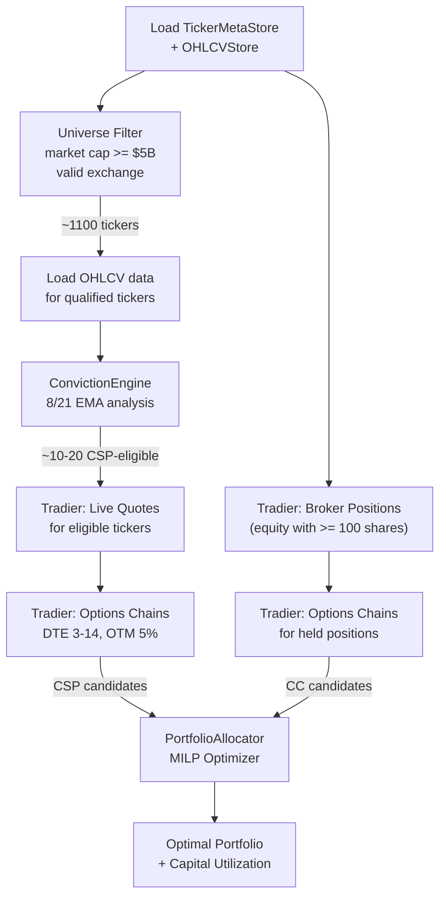

# Live Scan Workflow

**Source:** `backend/scripts/live_scan.py`

## Purpose

The live scan is a standalone CLI script that runs the full conviction-to-allocation pipeline against real-time market data. It identifies today's best CSP and CC opportunities and produces an optimal portfolio allocation using the MILP optimizer.

## Pipeline Steps



## Step-by-Step

### 1. Load and Filter Universe

Load `TickerMetaStore` for market caps and exchanges. Filter to tickers with:
- Market cap >= $5 Billion
- Exchange in `{XNYS, XNAS, XNMS, XASE, ARCX, BATS}`

Typical result: ~1,100 qualified tickers from ~12,000+ in the store.

### 2. Load OHLCV + Run Conviction Engine

Load historical daily bars from `OHLCVStore` for all qualified tickers. Run `ConvictionEngine.analyze_batch()` which:
- Computes 8/21 EMA for each ticker
- Classifies trend state
- Checks CSP eligibility (trend + extension <= 3% + 5-10 day streak)

Typical result: ~10-20 CSP-eligible tickers.

### 3. Fetch Live Quotes (Tradier)

Call `TradierClient.get_quotes()` for all eligible tickers. Display last price, bid, ask, and volume.

### 4. Scan CSP Candidates

For each eligible ticker with a live price >= $15:

1. Fetch available option expirations from Tradier
2. Filter to expirations within DTE range (default: 3-14 days)
3. Fetch the options chain for the nearest valid expiration
4. Find the best put strike: `strike <= price * (1 - OTM_PCT)` with `bid > 0`, pick the highest strike below the OTM threshold
5. Build a `ScoredCandidate` with premium, collateral, and annualized return

### 5. Scan CC Candidates (Broker Positions)

1. Fetch current positions from Tradier
2. Filter to equity positions with >= 100 shares
3. For each position with a live price >= $15:
   - Fetch options chain for the nearest valid expiration
   - Find the best call: `strike > last_price` AND `strike >= cost_basis`, pick by highest bid
   - Build a `ScoredCandidate`

### 6. MILP Optimization

Pass all CSP and CC candidates to `PortfolioAllocator.optimize()` with:
- Available capital (default: $100,000)
- Conviction signals from step 2
- Held shares from step 5

The optimizer returns the optimal trade allocation respecting all constraints.

## Constants

| Constant | Value | Description |
|---|---|---|
| `AVAILABLE_CAPITAL` | $100,000 | Cash available for CSP collateral |
| `MAX_POSITIONS` | 8 | Maximum distinct positions |
| `MAX_CONTRACTS` | 40 | Maximum contracts per position |
| `MAX_CONCENTRATION_PCT` | 25.0% | Maximum per-symbol collateral concentration |
| `MIN_MARKET_CAP` | $5 Billion | Minimum market capitalization |
| `MIN_PRICE` | $15 | Minimum stock price |
| `MIN_VOLUME` | 500,000 | Minimum average daily volume |
| `DTE_MIN` | 3 | Minimum days to expiration |
| `DTE_MAX` | 14 | Maximum days to expiration |
| `OTM_PCT` | 5% | Out-of-the-money target for strike selection |

## Running the Live Scan

```bash
cd backend
source .venv/bin/activate
python scripts/live_scan.py
```

Required environment variables:
- `TYCHE_TRADIER_API_TOKEN` — Tradier API token (production, not sandbox)
- `TYCHE_TRADIER_ACCOUNT_ID` — Tradier account ID
- `TYCHE_POLYGON_API_KEY` — Polygon.io API key (for bootstrap, not needed if data exists)

The script expects `data/ohlcv_daily.parquet` and `data/ticker_meta.parquet` to exist (run bootstrap first).

## Output Format

The script outputs four sections:

1. **Conviction-eligible tickers** — Table showing symbol, price, EMAs, extension %, days above, market cap
2. **Live quotes** — Real-time bid/ask/last from Tradier
3. **Options scanning** — Count of CSP and CC candidates found
4. **Optimal portfolio** — MILP-optimized allocation with contract counts, premiums, collateral, and annualized returns

## Morning Scan (API)

The same pipeline runs via the API endpoint `POST /scanner/scan`, orchestrated by `workflow/morning_scan.py`. The API version additionally:
- Loads account balances from the broker (uses actual buying power)
- Applies institutional ownership filters
- Fetches earnings dates
- Runs LLM analysis on top candidates (if Gemini configured)
- Returns results as JSON via the REST API
