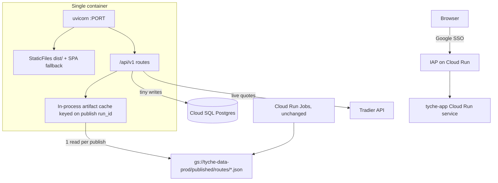

# Host Tyche on Cloud Run (API + SPA in one service) — spec v1

Status: **in progress** (started 2026-08-16)

Host the FastAPI backend and the built SPA as a single Cloud Run service behind
direct IAP, move the three stateful SQLite stores to Cloud SQL Postgres, and add
an in-process artifact cache keyed on the existing publish manifest.

Batch compute stays exactly as-is. The service is a reader plus a small write
path. Nothing in `infra/gcp/deploy_jobs.sh`, the Cloud Run Jobs, the Workflows,
or the Schedulers changes — see `docs/tyche_gcp_minimal_migration_spec_v2.md`
for that half of the system.

## Target architecture

## Why no Redis in iteration 1

- The entire published dataset is **6.92 MiB across 16 objects**
  (`stocks_screener.json` 2.44 MiB and `stocks_conviction.json` 2.0 MiB
  dominate). It fits in container memory.
- `publish_signals.py` already writes `published/manifest.json` containing
  `run_id`, `generated_at`, and per-route `status`/`as_of`. Poll that one small
  file; when `run_id` changes, drop the cache. See `_write_master_manifest` in
  `backend/src/tyche/workflow/publish_signals.py`.
- Postgres holds only tiny user state, so there is no expensive query to cache
  in front of it.
- Revisit Redis only if you later run many instances and want a shared cache;
  GCS already plays that role.

## Phase 1 — One container behind IAP

- New `backend/Dockerfile.api`: multi-stage, Node stage runs `npm ci && npm run
  build` in `frontend/`, Python stage copies `dist/` in. Command is uvicorn on
  `0.0.0.0:${PORT:-8080}`, no `--reload`. Do not reuse `backend/Dockerfile.jobs`
  — its `ENTRYPOINT` is `python scripts/run_gcp_job.py`.
- Build **without** the `[ml]` extra first. Nothing the UI calls needs XGBoost:
  the Alpha page uses `/alpha/scan` (published JSON), and only the unused
  `/alpha/signal/{ticker}` loads a model. This cuts image size and cold start
  materially.
- Serve the SPA in `backend/src/tyche/app.py`: mount `dist/assets`, then a
  catch-all returning `index.html` so client routes like `/stocks/screener`
  survive a refresh. Register it **after** the API router so `/api/v1` and
  `/health` still win. No frontend changes are needed — `frontend/src/api/client.ts`
  already uses `const BASE_URL = "/api/v1"`.
- Secrets: attach via `gcloud run deploy --set-secrets`. Add the Tradier token
  and account id to Secret Manager — they are missing from `SECRET_TO_ENV` in
  `backend/src/tyche/ops/gcp_secrets.py`. This avoids calling
  `bootstrap_gcp_runtime()`, which today only runs from the jobs entrypoint.
- Service account `tyche-ui@` (reserved in the migration spec, not yet created):
  GCS object **viewer** on `tyche-data-prod`, `secretAccessor`, `cloudsql.client`.
- Enable IAP **first in the console** so the OAuth client is created
  automatically (it cannot be created programmatically), then deploy with
  `--iap --no-allow-unauthenticated`, grant `roles/run.invoker` to
  `service-{PROJECT_NUMBER}@gcp-sa-iap.iam.gserviceaccount.com`, and grant
  yourself `roles/iap.httpsResourceAccessor`.
- New `infra/gcp/deploy_service.sh` mirroring the shape of
  `infra/gcp/deploy_jobs.sh`. Set `--min-instances=1` and `--cpu-boost` to keep
  the artifact cache warm.
- Fix the favicon 404: `frontend/index.html` references `/vite.svg`, which does
  not exist in the repo.

## Phase 2 — Cloud SQL Postgres for the three stateful stores

Scope is deliberately narrow: `stock_positions`, `exit_signals`, `config`, and a
new table replacing `expired_csps.json`. Leave `conviction.db`, `scans.db`,
`news.db`, and `backtest.db` as ephemeral SQLite for now — in GCS mode the API
does not read them on any page that works today.

- Smallest Cloud SQL Postgres instance, one database. Connect with
  `--add-cloudsql-instances` (Unix socket). Add `asyncpg` to
  `backend/pyproject.toml`.
- Point `init_positions_db()` at the Postgres URL in
  `backend/src/tyche/persistence/database.py`. The named-engine registry means
  **no repository code changes** — the multi-file split is a convention, not a
  relational design, and there are no cross-database SQL joins.
- `ConfigStore` is the one real refactor. It uses raw synchronous `sqlite3` with
  `INSERT OR REPLACE`, and it is called synchronously from `get_settings()`.
  Give it a **sync** SQLAlchemy engine (psycopg) with `ON CONFLICT DO UPDATE`.
  It runs once per process because `get_settings()` memoizes into
  `_settings_cache`, so a sync call is acceptable.
- Replace `ExpiryTracker`'s JSON file
  (`backend/src/tyche/workflow/expiry_tracker.py`) with a table. It holds under
  20 records with a 30-day cleanup.
- Establish an Alembic baseline. The single existing revision covers only the
  legacy `tyche.db` tables and is never run; production schema comes from
  `create_all` at startup. Run `alembic upgrade head` as a deploy step, not from
  the app.
- **Guard `scheduler_enabled`.** Confirm the key is absent from the config table,
  or hard-disable the scheduler when `data_backend == "gcs"` regardless of stored
  config. Otherwise the API container starts running batch jobs.

## Phase 3 — Artifact cache and freshness

- Add a `PublishedArtifactCache` that reads `published/manifest.json`, caches
  every route envelope in memory keyed on `run_id`, and re-reads only when
  `run_id` changes.
- Repoint `GET /conviction/version` at the manifest instead of `conviction.db`.
  This fixes the already-broken cloud invalidation signal and gives the frontend
  one poll that covers every daily route.
- Wrap the blocking GCS reads in `asyncio.to_thread`. `read_json` uses
  synchronous `gcsfs` and `pd.read_parquet` is sync, both called directly from
  `async def` handlers — a 2.4 MiB fetch currently stalls every concurrent
  request.
- Add `ETag` / `Cache-Control` derived from `generated_at` on the daily routes so
  the browser stops re-downloading megabytes.
- Extend the frontend version-invalidation in `frontend/src/hooks/useApi.ts` to
  alpha, screener, scanner, and intelligence. Today `useConvictionVersion` only
  invalidates the conviction family, while those four use `staleTime: Infinity`
  with no invalidation path.
- Lazy-load the recharts-heavy pages (`React.lazy` on Deep Dive at minimum) and
  add a manual chunk for recharts. All 18 pages are currently in one eager
  bundle, and recharts is by far the heaviest of the six runtime dependencies.

## Phase 4 — Close the cloud-mode gaps

- Split the inline-compute guard in `backend/src/tyche/api/cloud_mode.py` so
  **bounded** live operations are allowed while full-universe scans stay blocked.
  This restores Options Explore and Covered Calls Analyze; `POST /scanner/scan`
  should remain 409.
- Repoint `/stocks/pullbacks/active` and `/stocks/recommendations` at published
  artifacts. They read `conviction.db`, which cloud batch never writes, so the
  Stocks Dashboard shows them empty today.
- Decide how the exit monitor runs: either a small Cloud Run Job on a schedule,
  or accept manual `POST /stocks/positions/check-exits`.

## Costs and risks

- IAP is free and adds no load balancer cost. One warm Cloud Run instance and the
  smallest Cloud SQL Postgres are each in the low tens of dollars per month —
  worth confirming in the pricing calculator once CPU and memory are chosen.
- Main risk is schema management: `create_all` plus the runtime `ALTER TABLE` in
  `_migrate_conviction_columns()` is not safe against a shared database. Phase 2
  should not ship without the Alembic baseline.
- Deferred, not solved: `upsert_snapshots()` hard-imports
  `sqlalchemy.dialects.sqlite.insert` and `_migrate_conviction_columns()` emits
  SQLite types. Both only matter if `conviction.db` later moves to Postgres.

## Known user-visible behaviour changes

Called out before approval because they are not bugs, they are consequences:

- **Scanner "Scan Now", Options Explore, and Covered Calls "Analyze" return 409
  in GCS mode today.** The guard keys off `data_backend == "gcs"` wholesale, but
  Explore and CC-analyze are bounded per-ticker live-Tradier calls, not
  full-universe scans. Phase 4 restores the bounded two.
- **`scheduler_enabled` is a footgun.** It auto-disables when the backend is GCS,
  but only if the key is not explicitly stored in `config.db`. Moving config to
  shared Postgres means a value ever toggled in the Settings UI would make the
  Cloud Run API run APScheduler batch jobs in the web container.
- **The exit monitor stops running.** It is a scheduled job that updates
  `positions.db` at 4:05 PM ET; with the scheduler off in cloud, exit signals
  only update when the button is pressed.

---

# Implementation log

Kept current as work lands. "Operator" means it needs console access or incurs
spend, so it is not run autonomously.

## Phase 1

| Item | Status | Notes |
|---|---|---|
| `backend/Dockerfile.api` | done | Multi-stage Node 24 → Python 3.12. **Build context is the repo root**, not `backend/`, because the Node stage needs `frontend/`. Installs without `[ml]`. Single uvicorn worker on purpose so one process owns the artifact cache. |
| Root `.dockerignore` | done | New file. Required: the root context would otherwise ship `backend/data`, `backend/db`, and `frontend/node_modules`. |
| `static_dir` / `cors_allow_origins` settings | done | Env-only infra fields in `config.py` (`_ENV_ONLY_FIELDS`, `_EnvSettings`, `TycheSettings`). Image sets `TYCHE_STATIC_DIR=/app/static`; empty locally so Vite keeps serving the dev SPA. |
| Serve the SPA + favicon | done | New `api/static_files.py` `mount_spa()`, registered last in `create_app()`. One code path serves hashed assets (immutable) and the index fallback (`no-cache`); API prefixes 404 rather than returning HTML. Added the missing `frontend/public/favicon.svg`. |
| Secret Manager + `tyche-ui` SA | code done / operator run | `TRADIER_API_TOKEN` + `TRADIER_ACCOUNT_ID` added to `SECRET_TO_ENV` and `seed_secrets.sh`; new `setup_service_iam.sh` creates the SA with `objectViewer` (not `objectAdmin` — the service never writes artifacts). Running it needs project IAM access. |
| `infra/gcp/deploy_service.sh` | done | Mirrors `deploy_jobs.sh`. Defaults to `--no-allow-unauthenticated`; `--public` exists but warns. Prints the exact IAP follow-up commands. |
| Enable IAP | operator | OAuth client cannot be created programmatically. Re-run with `IAP_ENABLED=true` afterwards. |

Verified by building the image and running it:

- amd64 image builds clean (847 MB) and an arm64 build of the same Dockerfile
  serves `/`, a deep link (`/stocks/screener` → same document), `/favicon.svg`,
  the hashed asset with `immutable`, `/api/v1/system/config`, `/docs`, and 404s
  `/api/v1/nope`. Healthy 4 s after start.
- **The frontend stage must be pinned to `$BUILDPLATFORM`.** Building it for
  amd64 on Apple Silicon crashes esbuild under QEMU (`The service was stopped:
  write EPIPE`). The bundle has no native code, so building it natively is both
  correct and much faster.
- **An amd64 image cannot be smoke-tested locally on Apple Silicon.** pandas/
  pyarrow segfault under QEMU (`uncaught target signal 11`). Build arm64 for
  local runs; amd64 is what ships.

## Phase 2

| Item | Status | Notes |
|---|---|---|
| Cloud SQL instance | operator | Incurs spend. |
| `asyncpg` + `init_positions_db()` wiring | pending | |
| `ConfigStore` → sync SQLAlchemy | pending | |
| `expired_csps.json` → table | pending | |
| Alembic baseline | pending | |
| Hard-disable scheduler in GCS mode | done | `_build_settings` now overrides a **stored** `scheduler_enabled` instead of deferring to it, with `TYCHE_ALLOW_GCS_SCHEDULER` as an env-only escape hatch. Confirmed in-container: GCS mode logs `local_scheduler_disabled` and registers no jobs. |

## Phase 3

| Item | Status | Notes |
|---|---|---|
| `PublishedArtifactCache` | done | New `persistence/published_cache.py`, wired into `load_published_route()` — the single choke point every published route already goes through, so all routes benefit without touching each one. Keyed on `(storage context, run_id)`. Passes through uncached when no manifest exists, so local dev and tests are unaffected. |
| `/conviction/version` on the manifest | done | Was reading `conviction.db`, which cloud batch never writes (`persist_sqlite=False`) — the invalidation signal was **dead in cloud**. Now prefers the manifest and reports `run_id` + `source`; falls back to SQL for local mode. |
| `asyncio.to_thread` on published reads | done | 12 call sites across 7 route modules were doing synchronous GCS/Parquet reads inside `async def` handlers, so a single 2.4 MiB fetch stalled every concurrent request. |
| ETag / Cache-Control | done | `api/cache_headers.py` middleware tags the daily routes with the publish `run_id` plus path and query string, and answers `304`. Saves bandwidth, not server CPU — the body is still built before the comparison. Scoped by prefix so live broker routes are untouched. |
| Frontend invalidation + lazy chunks | done | Routes are `React.lazy` (named exports mapped in place, so the 19 page files are unchanged) with manual `recharts` / `react` / `query` chunks. Version invalidation now keys on `run_id` and covers screener, history, deep-dive, alpha, scanner, news, and filings — all of which used `staleTime: Infinity` with no invalidation path at all. |

Initial JS payload, measured from the real build:

| | raw | gzip |
|---|---|---|
| Before (one eager chunk) | 1,010.7 kB | 272.2 kB |
| After (entry + react + query) | 305.5 kB | **95.8 kB** |
| recharts, now deferred to Deep Dive only | 376 kB | 108.5 kB |

**Negative caching is not optional.** The first cache version only stored a
non-`None` manifest, so before any publish run every request re-probed storage.
It showed up as the test suite going from 88 s to 595 s (network probes per
request); in production it would have been a GCS round trip on every request.
`_ContextState.manifest_probed` now records the attempt separately from the
result. Pinned by `TestNegativeCaching`.

**Middleware must honour `app.dependency_overrides`.** Middleware sits outside
FastAPI's dependency injection, so calling `get_settings()` directly ignored the
isolated settings that test fixtures install and reached for the real GCS backend
from `.env`. `_resolve_settings()` checks the override first.

Cache design note worth keeping: the first version keyed entries on `route_key`
alone. That let one storage root serve another root's artifacts — it surfaced as
two tests passing alone but failing in the full suite. Fixed by including a
storage-context fingerprint in the key, with `TestContextIsolation` pinning it.

## Phase 4

| Item | Status | Notes |
|---|---|---|
| Split the inline-compute guard | pending | |
| Repoint pullbacks/recommendations | pending | |
| Exit monitor decision | pending | Needs a product call, not just code. |
